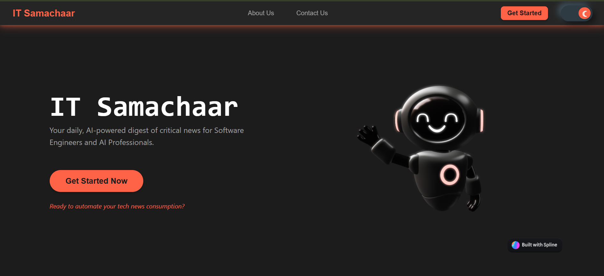
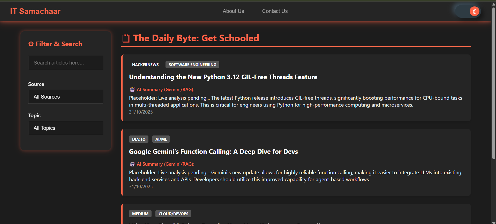

<div align="center">

#  IT Samachaar

### Real-Time Tech News • Clean UI • API Driven Platform

<p>
A modern web application that delivers the latest technology news in real-time using external APIs, designed with a clean interface and smooth user experience.
</p>

<br/>

<a href="YOUR_LIVE_LINK_HERE" target="_blank">
  
</a>

<br/><br/>


</div>

---

## Overview

**IT Samachaar** is a dynamic news web application focused on delivering the latest updates from the technology world.

The application fetches real-time news articles using an external API and displays them in a structured, user-friendly layout. It is designed to provide quick access to trending tech news with minimal loading time and clean presentation.

---

## Screenshots

<div align="center">

| Homepage | News Articles |
|----------|---------------|
|  |  |

</div>

---

## Explanation of UI

- **Homepage**  
  Displays the main interface where users can browse news categories or view trending articles.

- **News Articles Section**  
  Shows dynamically fetched news cards including:
  - Title  
  - Description  
  - Source  
  - Image  
  - Link to full article  

Each card is generated using API data and rendered dynamically using JavaScript.

---

## Key Features

- Real-time news fetching using API  
- Category-based filtering (e.g., Technology, Business, etc.)  
- Dynamic rendering of news articles  
- Clean and responsive UI  
- Clickable articles redirecting to original source  
- Efficient API handling and asynchronous data fetching  

---

## Technology Stack

<div align="center">

| Category | Technology |
|----------|-----------|
| Structure |  HTML |
| Styling |  CSS |
| Logic |  JavaScript |
| API |  News API |

</div>

---

## Project Structure

```
it_samachaar/
├── index.html
├── style.css
├── script.js
├── assets/
│   ├── home.png
│   └── news.png
└── README.md
```

---

## How It Works

1. Application loads homepage  
2. JavaScript sends request to News API  
3. API returns latest news data (JSON)  
4. Data is parsed and dynamically displayed  
5. User can browse and open articles  

---

## API Integration

```
GET https://newsapi.org/v2/top-headlines?country=in&category=technology&apiKey=YOUR_API_KEY
```

### Data Used

- Title  
- Description  
- Image URL  
- Source  
- Article URL  

---

## Getting Started

### Prerequisites

- Web browser (Chrome, Edge, etc.)  
- News API key  

---

### Installation

```bash
git clone https://github.com/priyanildz/IT-Samachaar.git
cd IT-Samachaar
```

---

### Setup API Key

Open `script.js` and replace:

```javascript
const API_KEY = "your_api_key_here";
```

---

### Run Project

Simply open:

```
index.html
```

in your browser

---

## Use Cases

- Stay updated with latest tech news  
- Learn API integration in frontend  
- Practice dynamic UI rendering  
- Build real-time web applications  

---

## Future Improvements

- Search functionality  
- Pagination or infinite scroll  
- Dark mode support  
- Backend integration for caching  
- User personalization  

---

## License

This project is licensed under the MIT License.

---

<div align="center">

Developed by  
<strong>priyanildz</strong>

</div>